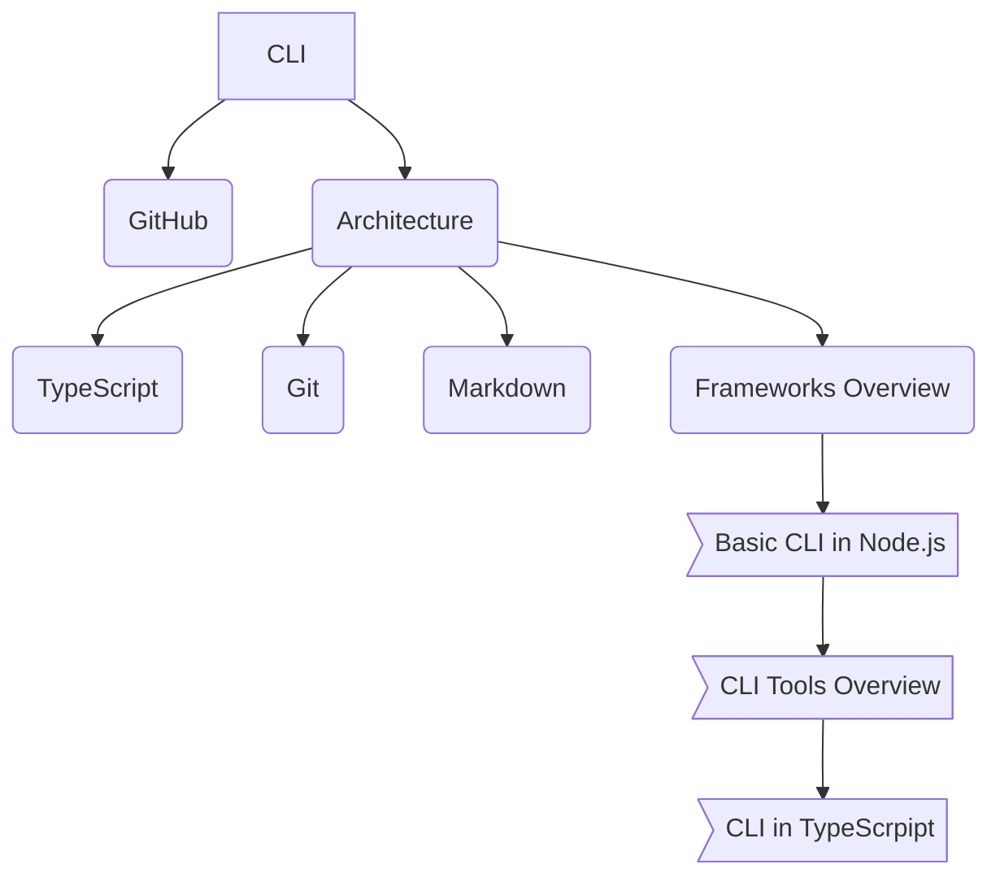

# Note - Educational Open Source CLI Project

Educational Open Source Notes Project to practice with JavaScript, TypeScript, Node, oclif, Git, ..., Project Management

# Goal

Write a Command Line Interface application to create, edit, delete, and manage notes. Notes are structured in a user defined folders structure as a Git repo. Each note is saved with the git commit command. The tool is and easily extendable with plugins. 

# Technologies

- TypeScript
- oclif
- Git

# Organizational Structure

with [mermaid syntax](https://mermaidjs.github.io/)



- [Basic CLI in Node.js](https://medium.com/js-planet/basic-cli-in-node-js-a9ed1a4f4bd4?source=announce)

- [Node CLI with Commander and Inquirer](https://medium.com/js-planet/node-cli-with-commander-and-inquirer-3eacc0086e7c?source=announce)

- [A Modern Way To Build a CLI with oclif in Node](https://codeburst.io/a-modern-way-to-build-a-cli-with-oclif-in-node-b7bb0df86623?source=announce)

# Features 

## Glossary

`note` - single commit with text data  
`notebook` - a collection of notes inside a folder

## Overview

- Add, edit, delete note and notebook 
- List note with user interaction (add an item)
- Print a note to PDF

# Examples

```bash
note notebook ideas "Store all ideas" 
# add folder *ideas* with a file *README.md* title *Store all ideas*
# ideas
# ├── README.md
note ideas list "A list of ideas" idea
# add a list *idea* inside *ideas/README.md* 
note ideas/idea "Write a CLI for notes"
# add an *idea* list item inside *ideas/README.md* 
```

Where a content of a *ideas/README.md* file will be

```markdown
# About

Store all ideas

# Table Of Contents

- [A list of ideas](#idea)

# <a href="#idea">Idea</a>

- Write a CLI for notes
```

Originally, a user can commit with an empty git repository modification

```sh
git commit --allow-empty -m "My Note"
```

# Links

- [Mermaid CLI](https://github.com/mermaidjs/mermaid.cli)

# Articles

- [Evolution of the Heroku CLI: 2008-2017](https://blog.heroku.com/evolution-of-heroku-cli-2008-2017)
- [12 Factor CLI Apps - Heroku](https://medium.com/@jdxcode/12-factor-cli-apps-dd3c227a0e46)

# Books

- [Linux Command Line and Shell Scripting Bible, 3rd Edition by Richard Blum, Christine Bresnahan](https://learning.oreilly.com/library/view/linux-command-line/9781118983843/#toc)

- [The CLI Book: Writing Successful Command Line Interfaces with Node.js by Robert Kowalski](https://learning.oreilly.com/library/view/the-cli-book/9781484231777/)
