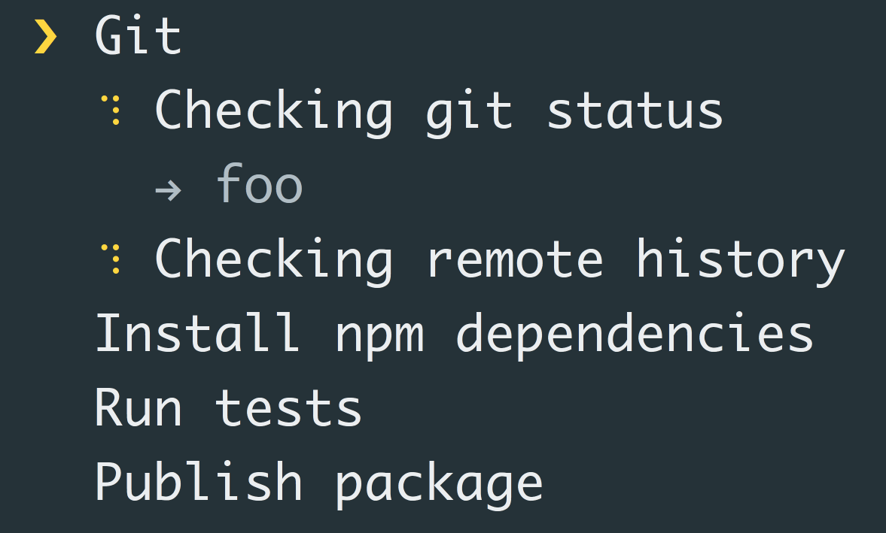

class: primary
count: false

# Mastering CLI in TypeScript
### by
## [Alex Korzhikov](http://github.com/korzio/)
### & 
## [Pavlik Kiselev](http://github.com/paulcodiny/) 

.right[
  II Part - Make it Shine

  Amsterdam

  8th of October 2019
]

---

# Mastering CLI in TypeScript - Agenda

.half-image[
  [](https://oclif.io/)
]

- Make it Shine 
  - Input & Output
  - Effects

- `oclif` in Depth
  - Arguments & Flags
  - Commands & Plugins
  - Hooks

- Test, Debug & Publish

---

# Goals

.half-image[
  [](https://oclif.io/)
]

- Make an `oclif` CLI application to todo

---

# Make it Shine

## Beautify Input and Output

---

# Effects

- Effects
  - `progress` show status
  - `figlet` ASCII output

.right.right-image[
  
]

.right[
> `listr` - terminal task list
]

- Decoration
  - `chalk, colors` for colors
  - `clui` output tables, status, charts
  - `cli-table` print table data

- Utilities
  - `clear` clear terminal
  - `debug` wrap console log

---

# @oclif/cli-ux

### oclif utilities for input & output

```ts
import cli from 'cli-ux'
cli.prompt('What is your password?', {type: 'mask'})
```

### Features

- `url(), open()` for urls
- `action()` immersive logs
- `table(), tree()` to print lists and structures

---

# Practice

.right-image.small-image[
  
]

### Make a command to list github tasks 

Use `@oclif/cli-ux` or whatever other tools to

- show a spinner while loading information,
- print the list,
- colors for printing open & closed issues.

```bash
note manage:github:issues list
...Loading...
ID    Title                     Description         Status
---------------------------------------------------------------
31    New CLI Issue Sprint      Task create         Open
      Change Command            sprint change 
                                by template        
7     Sprint 7 Change                               In Progress
```

Use `@octokit/rest` for `Github` requests

---

# Practice - Start Working on an Issue

### Develop a command to start working on an issue

Use `@oclif/cli-ux` `prompt()` functionality and GraphQL `Github` interface with `@octokit/graphql`.

```bash
note manage:github:issue start
Which issue you want to pick up?
41
Do you want to start working on the issue?
Y
Updated the issue #41 with "In Progress" status
```

.right-image.small-image[
  
]

> The [Apollo-Codegen](https://github.com/apollographql/apollo-codegen) tool can help with generating types from requests.

---

class: center

# Effects
## Q&A
## -->
# `oclif` in Depth

---

# Features

.half-image[
  [](https://oclif.io/)
]

### Arguments are declared on the command level, parsed by `oclif` and used for documentation generation

- `yargs`, `nops`, or `minimist` alternative libraries

- **Flags** change a format of an executed command `npm i --verbose`
- **Options** add customisation `git log --abbrev-commit --pretty=oneline -n 50`
- **Arguments** command operation targets `npm install yargs`

---

# Also Input

- **Environment Variables**

```bash
LOG_LEVEL=debug note
```

```ts
import {flags} from '@oclif/command'

export default class Example extends Command {
  static flags = {
    logLevel: flags.string({
      description: `Environment variable 'LOG_LEVEL'.\nIt CAN NOT be passed as a flag`,
      env: 'LOG_LEVEL',
    })
  }
}
```

- **Standard Input**

---

# Practice - Arguments

### Add filter flag to find only open issues

```bash
note manage:github:issues list --status=open
# ||
# note manage:github:issues list -s open

ID    Title                     Description         Status
---------------------------------------------------------------
31    New CLI Issue Sprint      Task create         Open
      Change Command            sprint change 
                                by template        
```

### [Command Flags - `oclif` official documentation](https://oclif.io/docs/flags)

---

# Practice - Flags

### Add `--json` flag to show issues list as `JavaScript` object

```bash
note manage:github:issues list --status=open --json

{
  id: 31,
  title: 'New CLI Issue Sprint Change Command',
  description: 'Task create sprint change by template',
  status: 'open' # green
}
```

### [TypeSript Compiler Options](https://www.typescriptlang.org/docs/handbook/compiler-options.html)

---

## Additional Practice Exercise - Columns

### Add format flag to specify lists columns

```bash
note manage:github:issues list --columns=id,title,status --json --status=open
# ||
# note manage:github:issues list -c id,title,status

{
  id: 31,
  title: 'New CLI Issue Sprint Change Command',
  status: 'open' # green
}
```

---

# Abstractions

### Configuration in `package.json` with `oclif` property


```json
"oclif": {
  "commands": "./lib/commands",
  "bin": "my-oclif",
  "plugins": [
    "@oclif/plugin-help"
  ],
  "hooks": {
    "commit": "./lib/hooks/commit/commit"
  }
},
```

### oclif CLI `manifest` command generates configuration declaration for publish and load details purposes

### List of useful plugins made by `oclif`, like `plugin-help`, `plugin-autocomplete` or `plugin-plugins`

---

# Practice - Commands VS Plugins

- `Command` is a granular functionality
- `Plugin` is a pack of `commands` grouped by any semantic reason

### Move `Github` commands and logic into a new plugin

.small-code[

```bash
oclif plugin test

     _-----_
    |       |    ╭──────────────────────────╮
    |--(o)--|    │   Time to build a oclif  │
   `---------´   │  plugin! Version: 1.13.6 │
    ( _´U`_ )    ╰──────────────────────────╯
    /___A___\   /
     |  ~  |
   __'.___.'__
 ´   `  |° ´ Y `

? npm package name test
? description
? author Alex Korzhikov @korzio
? version 0.0.0
? license MIT
? Select a package manager npm
? TypeScript Yes
? Use tslint (linter for TypeScript) Yes
? Use mocha (testing framework) Yes
```

]

---

# Hooks

### Extending commands like lifecycle callbacks

- `init` - before any command when CLI is initialied,
- `prerun` - after `init` hook, but also before the command,
- `command_not_found` - if a command is not found before the error
- `preupdate`
- `update`
- `plugins:preinstall`

#### Custom hooks can be called programmatically

```ts
await this.config.runHook('custom', { arguments })
```

---

# Practice - Notify Slack on Issues Update

### Make a hook to notify slack on issues update

```bash
oclif hook notify --event=notify
cat src/hooks/notify/notify.ts
```

```ts
import {Hook} from '@oclif/config'

const hook: Hook<'notify'> = async function (opts) {
  process.stdout.write(`example hook running ${opts.id}\n`)
}

export default hook
```

```bash
note manage:github:issue start
# after the issue start command is finished
# the notify hook sends slack message
```

---

# Debug

### How to debug a CLI program with `VSCode`?

.center[
  
]

---

# Demo

### TODO `VSCode` config

---

# Tests

### oclif test framework based on mocha TODO

---

# Practice - Tests

### TODO Write unit or integration tests for `Github` manage list 

```
note manage:github:issues list
```

---

# Practice - NodeConf Badge

### TODO Make a notify hook to notify NodeConf Badge about issue update

---

# Summary

.right-image[]

- TODO Practice with CLI in `Node` with `TypeScript` and popular frameworks & libraries

---

# Docs

- [Evolution of the Heroku CLI: 2008-2017](https://blog.heroku.com/evolution-of-heroku-cli-2008-2017)

- [12 Factor CLI Apps - Heroku](https://medium.com/@jdxcode/12-factor-cli-apps-dd3c227a0e46)

- [Building Great CLI Experiences in Node - Jeff Dickey, Heroku](https://www.youtube.com/watch?v=Izx3-KSuaM8)

- [Build a JavaScript Command Line Interface (CLI) with Node.js — SitePoint](https://www.sitepoint.com/javascript-command-line-interface-cli-node-js/)

---

# Awesome Projects

.right-code[
```bash
npx cowsay "Thank you\!"
 ________
< Thank you! >
 --------
        \   ^__^
         \  (oo)\_______
            (__)\       )\/\
                ||----w |
                ||     ||
```
]

- `cowsay`
- `cash` - linux shell command cross platform
- [Power Up Your Command Line - Darren Burns](https://darrenburns.net/posts/tools)

---

class: center, middle
# Thank you!
## Questions?

.left[
Twitter: **[AlexKorzhikov](https://twitter.com/AlexKorzhikov)**  
Medium: **[korzio](https://medium.com/@korzio)**  
Github: **[korzio](https://github.com/korzio)**  
]

.right[
**[LinkedIn](
https://www.linkedin.com/in/pavlik-kiselev-06993347/)**  
Github: **[paulcodiny](https://github.com/paulcodiny)**  
]