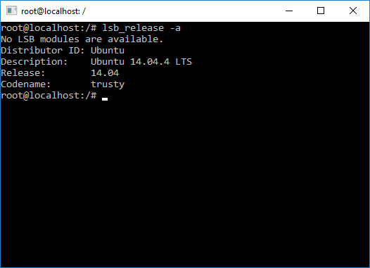

summary: CLI In Node
id: cli-in-node
categories: codelab,markdown
status: Published 
authors: Alex
Feedback Link: https://alex.io

---

## CLI In Node - Introduction
Duration: 1

> sA command-line interface or command language interpreter (CLI), is a means of interacting with a computer program where the user (or client) issues commands to the program in the form of lines of text (command lines). A program which handles the interface is called a command language interpreter or shell.

(c) Wiki

---

## Porqué?
Duration: 1

### Which CLI program
- Do you like?
- Do you use the most?


  
- Why `CLI`?
- Why `JavaScript`?
- Why `Node`?
- Why `TypeScript`?

---

## Why CLI?
Duration: 1

### ➕

- **Tools** for 
  - manipulating OS concepts,
  - improving **developer experience** and
  - task automation
- *which allow to gain even more by combining them!*
- *It's fun!*

### ➖?

---

## CLI Targets
Duration: 1

- CLI for API
- CLI for Domains
- CLI for Unification

## Why JavaScript?
Duration: 1

- JavaScript CLI for JavaScript Tasks
- JavaScript CLI for FrontEnd

```bash
npx cowsay hello cow
 ___________
< hello cow >
 -----------
        \   ^__^
         \  (oo)\_______
            (__)\       )\/\
                ||----w |
                ||     ||
```

---

## Why Node?
Duration: 1

### ➕

- Practice with `JavaScript`
- [Atwood's Law](https://blog.codinghorror.com/the-principle-of-least-power/) - *any application that can be written in JavaScript, will eventually be written in JavaScript*
- Fast and easy to develop
- Cross Platform
- A rich infrastructure with all kinds of packages and libraries with `npm` 
- Modules & plug'n'play

### ➖?
- `Node` need to be installed?!


## Question
Duration: 1

### > Why force the consumer to have all of node installed on their machine for a simple CLI?


- We build for Fronted developers, they have node installed already

- In some environments (browsers, are you crazy?!) `Node` even doesn't need to be installed

Why Node
A common question we’ve heard is: why the migration to Node for our plug-in architecture? We’re still Ruby fans but we also firmly believe in using the right tool for the right job, in this case we felt Node offered some key benefits. When it comes to creating a great CLI experience we wanted no platform (Linux, OS X, Windows) to feel superior to the other, but rather wanted all to have a great and powerful CLI experience should you choose to use it. The Node ecosystem of packages brings broader coverage of cross-platform compatibility, meaning you can simply use many of the packages you’d like to develop plug-ins more quickly and easily while not having to worry about as many compatibility issues.

https://blog.heroku.com/making_cli_plugins_better_with_a_new_architecture

---

## [Why TypeScript?](https://itnext.io/why-use-typescript-good-and-bad-reasons-ccd807b292fb)
Duration: 1

### ➕

- Types for unifying protocols and interfaces, checked statically Ahead Of Time
  - According to [To Type or Not to Type: Quantifying Detectable Bugs in JavaScript
  by Zheng Gao, Christian Bird, Christian Bird](http://ttendency.cs.ucl.ac.uk/projects/type_study/documents/type_study.pdf) study, using TypeScript results in 15% decrease of bugs
  - Focus on API, not on implementation details
  
- OOP patterns and abstractions
- IDE help & support for writing code which will save your developers time

### ➖

- Takes more time to develop and maintain projects

---

## Shell
Duration: 1

<!-- 
  http://tldp.org/LDP/Bash-Beginners-Guide/html/
  
  The restricted shell
  - When invoked as rbash or with the --restricted or -r option, the following happens:
  - The cd built-in is disabled.
  - Setting or unsetting SHELL, PATH, ENV or BASH_ENV is not possible.
  - Command names can no longer contain slashes.
  - Filenames containing a slash are not allowed with the . (source) built-in command.
  - The hash built-in does not accept slashes with the -p option.
  - Import of functions at startup is disabled.
  - SHELLOPTS is ignored at startup.
  - Output redirection using >, >|, ><, >&, &> and >> is disabled.
  - The exec built-in is disabled.
  - The -f and -d options are disabled for the enable built-in.
  - A default PATH cannot be specified with the command built-in.
  - Turning off restricted mode is not possible.
  
  After the forking process, the address space of the child process is overwritten with the new process data. This is done through an exec call to the system.
-->

> a **program** that takes commands from the keyboard and gives them to the operating system to perform

```bash
cat /etc/shells   # List of shells
cat /etc/passwd   # Default shell
```

### What is your default shell?

- Interactive, non-interactive, login, non-login
- Built-in commands and scripts
- When a program is executed, a Bash process is forked

```bash
htop + bash
```

- [SS64 Command line reference](https://ss64.com/)

---

## Windows Specifics
Duration: 5

<!-- 
> Под Win глобально без /bin/ не ставится, приходится локально
> Нужно какой-то .cmd создать и параметр bin в `package.json`
> В win шабанг не работает, надо .cmd делать, лишний шаг
 -->

- `cmd.exe` or `Command Prompt` - *venerable* Windows Command Processor
- `Windows Console` - a program to run applications with text-based interface
- `PowerShell` an extended scripting language and a framework, providing powerful command-line tools for most Windows capabilities and APIs

Releases:

- Announced in 2003 
- 1st Release in 2006
- 2nd Version 2009

- Or try to run `bash` directly with [Windows Subsystem for Linux](https://docs.microsoft.com/en-us/windows/wsl/about) (for Windows 10)

`bash.exe` process running on a Linux Instance on Windows

[](https://blogs.windows.com/windowsdeveloper/2016/03/30/run-bash-on-ubuntu-on-windows/)


- environment variables are different (HOME vs HOMEPATH)
- use `path` module
- running processes

```js
const { spawn } = require('child_process');
const bat = spawn('cmd.exe', ['/c', '"my script.cmd"']);
```

- `shelljs`?

### How to run Node program in Windows?

```bash
$user/AppData/Roaming/npm
```

> In Windows, .cmd extension file is also generated along with previous file to make sure execution of .js file with Node.js only. I will explain this bit later.

```batch
@echo off

node "%~dp0\run" %*
```

- `%*` - will return the remainder of the command line starting at the first command line argument (in Windows NT 4, %* also includes all leading spaces)
- `%~dn` - will return the drive letter of %n (n can range from 0 to 9) if %n is a valid path or file name (no UNC)
- `%~pn` - will return the directory of %n if %n is a valid path or file name (no UNC)


https://www.npmjs.com/package/cmd-shim


- [Batch files - Command line parameters](https://www.robvanderwoude.com/parameters.php)
<!-- 
> Setting environment variables in Windows cmd.exe command line
https://learning.oreilly.com/library/view/nodejs-complete-reference/9781789952117/4f037649-10de-4a0e-80e0-12882a817528.xhtml -->
- [Learn About Windows Console & Windows Subsystem For Linux (WSL) - Microsoft](https://blogs.msdn.microsoft.com/commandline/learn-about-windows-console-and-windows-subsystem-for-linux-wsl/)
- [Spawning .bat and .cmd files on Windows - Official Node Documentation on Child Processes](https://nodejs.org/api/child_process.html#child_process_spawning_bat_and_cmd_files_on_windows)

---

## Principles Question
Duration: 1


  
### Which basic principles of designing a `CLI` program you might mention?

---

## Examples
Duration: 1


### Principles


- Understand what's happening
  - `help`
  - `version`
  - `logs, messages, errors`
- `Do One Thing and Do It Well`

### Top

- `git`
- `npm`

### Generators & Developer Experience

- yeoman
- create-react-app
- angular-cli

---

## Q&A
Duration: 1
