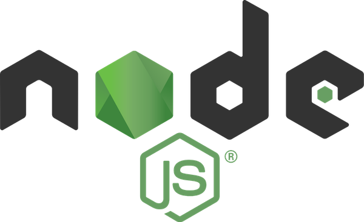

summary: Final
id: final
categories: codelab,markdown
status: Published 
authors: Alex
Feedback Link: https://alex.io

# Final

---

## Summary
Duration: 1

- Understand Basic CLI Concepts

- Overviewed different `npm` packages for developing a CLI

- Practice with CLI in `Node` with `TypeScript` and popular frameworks & libraries

---

## Docs
Duration: 1

- [Evolution of the Heroku CLI: 2008-2017](https://blog.heroku.com/evolution-of-heroku-cli-2008-2017)

- [12 Factor CLI Apps - Heroku](https://medium.com/@jdxcode/12-factor-cli-apps-dd3c227a0e46)

- [Building Great CLI Experiences in Node - Jeff Dickey, Heroku](https://www.youtube.com/watch?v=Izx3-KSuaM8)

- [Build a JavaScript Command Line Interface (CLI) with Node.js — SitePoint](https://www.sitepoint.com/javascript-command-line-interface-cli-node-js/)

---

## Thank you!
## Questions?
Duration: 1

Twitter: **[AlexKorzhikov](https://twitter.com/AlexKorzhikov)**  
Medium: **[korzio](https://medium.com/@korzio)**  
Github: **[korzio](https://github.com/korzio)**  

**[LinkedIn](
https://www.linkedin.com/in/pavlik-kiselev-06993347/)**  
Github: **[paulcodiny](https://github.com/paulcodiny)**  