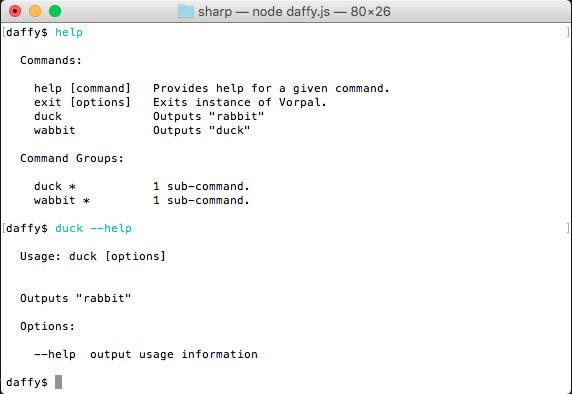
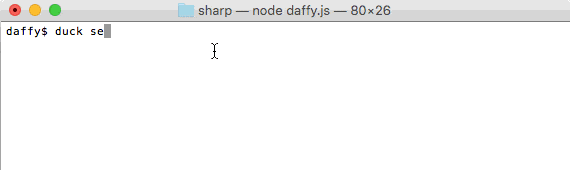

summary: Hands-on CLI in Node
id: hands-on-cli-in-node
categories: codelab,markdown
status: Published 
authors: Alex
Feedback Link: https://alex.io

# Hands-on CLI in Node

---

## Tools Overview
Duration: 1

### TODO compare table commander / gluegun / ...

| Tool         | Type      | Goal          | Features  |
| ------------ | --------- | ------------- | --------- |
| prompt       | utility   | Command-line prompt | prompt |
| inquirer.js  | utility   | A collection of common interactive command line user interfaces. | error feedback, asking questions, parsing input, validating answers, hierarchical prompts |
| commander.js | toolkit   | The complete solution for node.js command-line interfaces, inspired by Ruby's commander.      |    $1 |
| gluegun      | toolkit | Gluegun is a delightful toolkit for building Node-based command-line interfaces (CLIs) in TypeScript or modern JavaScript      | parameters, patching, filesystem, system, http, prompt, print, semver, strings |
| vorpal       | framework | Vorpal is Node's framework for building interactive CLI applications. Based on commander.js and inquirer.js | required/optional args, prompts, generator, piped commands, persistent command history, auto-gen docs/help, autocomplete |
| oclif        | framework | Framework for building CLIs  | Flag/Argument parsing, prompts, fast, generator, testing helpers, auto-gen docs/help, plugins, hooks, TS, auto-updating installers, autocomplete |
| node-cmdln | utility | TODO | |
| yargs | utility | TODO | |
| meow | utility | a tiny CLI helper, `gluegun` toolbox like | |

---

## Commander.js
Duration: 1

```javascript
var program = require('commander')

program
  .version('0.1.0')
  .option('-p, --peppers', 'Add peppers')
  .option('-P, --pineapple', 'Add pineapple')
  .option('-b, --bbq-sauce', 'Add bbq sauce')
  .parse(process.argv)

console.log('you ordered a pizza with:')
if (program.peppers) console.log('  - peppers')
if (program.pineapple) console.log('  - pineapple')
if (program.bbqSauce) console.log('  - bbq')
console.log('  - %s cheese', program.cheese)
```

- Parse arguments
- Modular
- Auto-documentation

---

## Inquirer
Duration: 1

### User's input


#### Alternatives

- `cli-ux`
- `prompt`

---

## [Vorpal](https://vorpal.js.org/)
Duration: 1

- Immersive Experience
- Auto documentation
- Parse arguments
- Input 
- Autocompletion

 

  
---

## [Gluegun](https://github.com/infinitered/gluegun)
Duration: 1

> toolkit for building Node-based command-line interfaces (CLIs) in TypeScript or modern JavaScript

```ts
module.exports = {
  name: 'generate', alias: ['g'],
  run: async (toolbox: GluegunToolbox) => {
    const {
      parameters: { first: project }, strings: { lowerCase, upperFirst },
      template: { generate }, print: { info }, prompt: { ask }
    } = toolbox

    // ask a series of questions
    const { branch } = await ask([{ type: 'input', name: 'branch', message: 'What would be an example for branch naming convention?' }])

    const fileName = 'CONTRIBUTING.md'
    const target = `${lowerCase(project)}/${fileName}`

    await generate({
      template: `${fileName}.ejs`,
      target, props: { project, branch },
    })

    info(`Generated ${fileName} file at ${target}`)
  },
}
```
