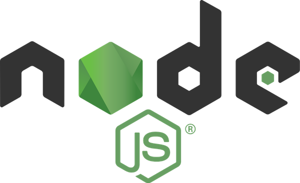

summary: Introduction
id: introduction
categories: codelab,markdown
status: Published 
authors: Alex
Feedback Link: https://alex.io

# Introduction

---

## Agenda
Duration: 1

- CLI in Node
  - CLI Targets
  - Shell
  - Examples - npm, git
  - Basic Principles

- Hello World CLI in Node
  - `package.json`
  - `TypeScript`
  
- Hands-on CLI in Node
  - Tools Overview - [prompt](https://www.npmjs.com/package/prompt) & [Inquirer.js](https://github.com/SBoudrias/Inquirer.js#documentation), `Commander.js`, `Vorpal`, `gluegun`

- Make it Work with `oclif`
  - Configure `oclif` project
  - Develop a command to slack hello world

- Make it Shine 
  - Input & Output
  - Effects

- `oclif` in Depth
  - Arguments & Flags
  - Commands & Plugins
  - Hooks

- Test, Debug & Publish

---

## Goals
Duration: 1

- Understand Basic CLI Concepts

- Practice coding `JavaScript` & `TypeScript` CLI programs in `Node` 

- Overview popular `npm` tools, libraries & frameworks for constructing CLIs

- Make an `oclif` CLI application to send Hello World notification to `slack` 

---

## Who are we?
Duration: 1

### [Alex Korzhikov](http://github.com/korzio/)
#### `JavaScript, Node, Web Components, TypeScript` 
### @ING @Otus

- Twitter: **[AlexKorzhikov](https://twitter.com/AlexKorzhikov)**  
- Medium: **[korzio](https://medium.com/@korzio)**  
- Github: **[korzio](https://github.com/korzio)**  

---

## Who are we?
Duration: 1

### [Pavlik Kiselev](http://github.com/paulcodiny/) 
#### `JavaScript, Serverless, React, GraphQL` 
### @NonDutch

- **[LinkedIn](
https://www.linkedin.com/in/pavlik-kiselev-06993347/)**  
- Github: **[paulcodiny](https://github.com/paulcodiny)**  
