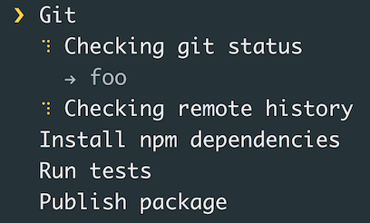

summary: Make it Shine
id: make-it-shine
categories: codelab,markdown
status: Published 
authors: Alex
Feedback Link: https://alex.io

# Make it Shine

---

## Effects
Duration: 1

### Beautify Input and Output

- Effects
  - `progress` show status
  - `figlet` ASCII output


> `listr` - terminal task list

- Decoration
  - `chalk, colors` for colors
  - `clui` output tables, status, charts
  - `cli-table` print table data

- Utilities
  - `clear` clear terminal
  - `debug` wrap console log

---

## @oclif/cli-ux
Duration: 1
Duration: 1

#### oclif utilities for input & output

```ts
import cli from 'cli-ux'
cli.prompt('What is your password?', {type: 'mask'})
```

#### Features

- `url(), open()` for urls
- `action()` immersive logs
- `table(), tree()` to print lists and structures

---

## Practice
Duration: 1


#### Make a command to list github tasks 

Use `@oclif/cli-ux` or whatever other tools to

- show a spinner while loading information,
- print the list,
- colors for printing open & closed issues.

```bash
note manage:github:issues list
...Loading...
ID    Title                     Description         Status
---------------------------------------------------------------
31    New CLI Issue Sprint      Task create         Open
      Change Command            sprint change 
                                by template        
7     Sprint 7 Change                               In Progress
```

Use `@octokit/rest` for `Github` requests

---

## Practice - Start Working on an Issue
Duration: 1

#### Develop a command to start working on an issue

Use `@oclif/cli-ux` `prompt()` functionality and GraphQL `Github` interface with `@octokit/graphql`.

```bash
note manage:github:issue start
Which issue you want to pick up?
41
Do you want to start working on the issue?
Y
Updated the issue #41 with "In Progress" status
```


> The [Apollo-Codegen](https://github.com/apollographql/apollo-codegen) tool can help with generating types from requests.

---

## Effects
### Q&A