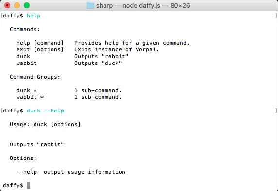

class: primary
count: false

# Mastering CLI in TypeScript
### by
## [Alex Korzhikov]() 
## [Pavlik Kiselev]() 

.right[
  Amsterdam
  
  15th of September 2019
]

.hidden[
  https://www.npmtrends.com/commander-vs-yargs-vs-oclif-vs-minimist-vs-vorpal-vs-inquirer
]

---

class: top white

# Can you hear and see me well?

```bash
> Write to chat
> + good
> – problems with audio or video
```

---

# Agenda

- Introduction
  
.right-image[
  
]

- Theory - CLI in Node (10 min)
  - Why CLI?
  - Why JavaScript / Node?
  - Shell
  - Examples - npm, git
  - Basic Principles

- Practice - Hello World CLI in Node (10 min)
  - package.json
  - main, bin, doc, man, url
  - process arguments
  
- Theory - Hands-on CLI in Node.js (15 min)
  - Best Practices
  - Tooling Overview 
    - > [prompt](https://www.npmjs.com/package/prompt)
      > [Inquirer.js](https://github.com/SBoudrias/Inquirer.js#documentation)
  - `Commander.js` & `Vorpal`
  - `TypeScript`
  - `gluegun`

- Practice - Make it Work - with `oclif` (15 min)
  - `oclif`
  - Configure project
  - Develop a command to tweet hello world

- Theory & Practice - UX - Make it Shine - Beautify Input and Output (20 min)
  - Colors - `@oclif/cli-ux`
  - Effects
  - Develop a command to list github tasks (use tabs, loader, colors, prompt)

- Theory & Practice - `oclif` specifics (50 min)
  - Classes
  - Plugins
    - Develop a plugin to TODO
  - Commands
    - Develop a command to TODO
  - Arguments
  - Shortcuts
  - Output
    - Update a command to show output in `json` format, `--json`
  - Configuration
  - Hooks
  - Develop a hook to commit and push to `git` repository
  - Tests
  - Develop a command and write tests for TODO
  - Shell completion
  - Add a plugin for shell completion

- Overall - 2:00 hours

- Other topics
  - NodeConf Badge
  - CLI Targets
    - CLI for API
    - CLI for Domains
    - CLI for Unification
    - JS CLI for JS
    - JS CLI for FrontEnd
  - Compile (install file, exe)
  - Architecture

.half-image[
  
]

---

# Goals

.right-image[]

<br>

- Get to know each other

- Introduce `JavaScript` Planet goals and motivation

- Understand Basic CLI Concepts

- Practice CLI in `Node` with popular libraries

- Overview popular questions and answers of `Node`

---

# Who are we?

.right[

]

---

# Who are we?

.image[

]

---

# To start with - Introduce yourself! 😀

- Who are you?
- What's your programming experience?
- Do you have questions about `Node`?

<br>

.center[
  
]

---

# Question

- Which `JavaScript` frameworks do you use?
- Which `JavaScript` libraries do you use?
- What is the difference between libraries and frameworks?

<br>

.center[
  
]

---

# Docs

- [Evolution of the Heroku CLI: 2008-2017](https://blog.heroku.com/evolution-of-heroku-cli-2008-2017)

- [12 Factor CLI Apps - Heroku](https://medium.com/@jdxcode/12-factor-cli-apps-dd3c227a0e46)

- [Building Great CLI Experiences in Node - Jeff Dickey, Heroku](https://www.youtube.com/watch?v=Izx3-KSuaM8)

- [Build a JavaScript Command Line Interface (CLI) with Node.js — SitePoint](https://www.sitepoint.com/javascript-command-line-interface-cli-node-js/)

- [Node Core Concepts](https://nodejs.org/en/docs/guides/)

- [Package Manager for JavaScript](https://docs.npmjs.com/)

- [My Stories](https://medium.com/@korzio)


---

# Introduction

### A command-line interface or command language interpreter (CLI), is a means of interacting with a computer program where the user (or client) issues commands to the program in the form of lines of text (command lines). A program which handles the interface is called a command language interpreter or shell.

(c) Wiki

---

# Porque?

### Which CLI program
- Do you like?
- Do you use the most?

.center[
  
]

- Why JavaScript?
- Why Node?

---

# Popular CLIs

.right-code[]
.right-code[]

### Top

- `git`
- `npm`

### Runners

- gulp
- grunt

### Generators & Developer Experience

- yeoman
- create-react-app
- angular-cli
- polymer-cli

---

# Why CLI?

### .green[`+`]

- **Tools** for 
  - improving **developer experience** and
  - task automation
- *which allow to gain even more!*
- *That's fun!*

### .red[`-`]?

---

# Why Node?

### .green[`+`]

- Practice with `JavaScript`
- [Atwood's Law](https://blog.codinghorror.com/the-principle-of-least-power/) - *any application that can be written in JavaScript, will eventually be written in JavaScript*
- Fast and easy to develop
- A rich infrastructure with all kinds of packages and libraries with `npm` 
- Modules & plug'n'play

### .red[`-`]?
- `Node` need to be installed?!

.hidden[

# Question

### > Why force the consumer to have all of node installed on their machine for a simple CLI?


- We build for Fronted developers, they have node installed already

- In some environments (browsers, are you crazy?!) `Node` even doesn't need to be installed
]

---

# Shell

.hidden[
  http://tldp.org/LDP/Bash-Beginners-Guide/html/
  
  The restricted shell
  - When invoked as rbash or with the --restricted or -r option, the following happens:
  - The cd built-in is disabled.
  - Setting or unsetting SHELL, PATH, ENV or BASH_ENV is not possible.
  - Command names can no longer contain slashes.
  - Filenames containing a slash are not allowed with the . (source) built-in command.
  - The hash built-in does not accept slashes with the -p option.
  - Import of functions at startup is disabled.
  - SHELLOPTS is ignored at startup.
  - Output redirection using >, >|, ><, >&, &> and >> is disabled.
  - The exec built-in is disabled.
  - The -f and -d options are disabled for the enable built-in.
  - A default PATH cannot be specified with the command built-in.
  - Turning off restricted mode is not possible.
  
  After the forking process, the address space of the child process is overwritten with the new process data. This is done through an exec call to the system.
]

> a **program** that takes commands from the keyboard and gives them to the operating system to perform

```bash
cat /etc/shells   # List of shells
cat /etc/passwd   # Default shell
```

### What is your default shell?

- Interactive, non-interactive, login, non-login
- Built-in commands and scripts
- When a program is executed, a Bash process is forked

```bash
htop + bash
```

---

# Principles Question

.half-image.right-image[
  
]

### Which basic principles of designing a `CLI` program you might mention?

---

# Principles

- A user want to understand what's happening
  - `help`
  - `version`
  - `logs, messages, errors`
  
.right-image[]

- [UNIX Philosophy](https://en.wikipedia.org/wiki/Unix_philosophy)
  - `Do One Thing and Do It Well`
  - `KISS`
  - `Modular and composable programs`

- Environments
  - `linux, mac os, windows`
  - `package`

---

# ...

- Shortcuts
- Exit codes

---

class: center

# Basic Principles
## Q&A
## -->
## Practice

---

# Exercise

---

# Windows Specifics

---

# package.json

```json
{
  "name": "my-test-cli",
  "version": "1.0.0",
  "description": "Hello CLI",
  "main": "server.js",
  "bin": "server.js",
  "scripts": {
    "test": "echo \"Error: no test specified\" && exit 1"
  },
  "keywords": [],
  "author": "",
  "license": "ISC",
  "man" : "./man/doc.1"
}
```

- `main` - exports
- `bin` - make an executable `symlink` inside `PATH`, `./node_modules/.bin/`
- `url` - [`npm bugs`](https://docs.npmjs.com/files/package.json#bugs) - feedback on a package 
🤗

---

# Execution

- `shebang` specifies an interpeter in `*nix` systems

```js
#!/usr/bin/env node
```

- `process.argv` contains arguments which a program is called with

<br>

### What will be an output of running `server.js`?

```javascript
console.log(process.argv)
```

<br>

```bash
node server hello world
```

- [`repl`](https://nodejs.org/api/repl.html) internal module provides a Read-Eval-Print-Loop (REPL) implementation

---

# Exercise

---

# Commander.js

```javascript
var program = require('commander');

program
  .version('0.1.0')
  .option('-p, --peppers', 'Add peppers')
  .option('-P, --pineapple', 'Add pineapple')
  .option('-b, --bbq-sauce', 'Add bbq sauce')
  .parse(process.argv);

console.log('you ordered a pizza with:');
if (program.peppers) console.log('  - peppers');
if (program.pineapple) console.log('  - pineapple');
if (program.bbqSauce) console.log('  - bbq');
console.log('  - %s cheese', program.cheese);
```

- Parse arguments
- Modular
- Auto-documentation

---

# Inquirer

### User's input


#### Alternatives
- `cli-ux`
- `prompt`

---

# Vorpal

.right-code[
#### https://vorpal.js.org/ <br><br>
- Immersive Experience
- Auto documentation
- Parse arguments
- Input 
- Autocompletion
]

.half-image[
   <br><br>
  
]

https://www.telerik.com/blogs/creating-node-js-command-line-utilities-improve-workflow

---

.half-image[
  [](https://oclif.io/)
]

### *Heroku, SalesForce* framework to build CLIs

### Features

- `TypeScript` (can be `JavaScript`)
- Auto-documentation
- Parse Arguments
  - Flags VS Arguments
- Code generation (with `yeoman`)
  - Single Commands VS Multi Commands
- Project' folders structure
- Hooks - a way to extend commands behavior
- Test & Build & Package

---

# oclif Main Concepts

- Extend `Command` class

```
import Command from '@oclif/command'

export class MyCommand extends Command {
  static description = 'description of this example command'

  async run() {
    console.log('running my command')
  }
}
```

## Plugins & Core

- `@oclif/config` - base config object and standard interfaces for oclif components
- `@oclif/plugin-plugins` - install plugins with the CLI


---

# TypeScript

### How to run TypeScript in Node?

- [Node Modules](https://nodejs.org/api/modules.html#modules_require_extensions)
- [How Require Extensions Work - James Talmage](https://gist.github.com/jamestalmage/df922691475cff66c7e6)

> the TypeScript Node (ts-node) - the on-the-fly module extension and REPL for Node

```
var oldHook = require.extensions['.js']
require.extensions['.js'] = function (module, file) {
  var oldCompile = module._compile
  module._compile = function (code, file) {
    code = code + '; console.log(bar)'
    module._compile = oldCompile
    module._compile(code, file)
  }
  oldHook(module, file)
}

require('./')
```

---

# Feedback

## Please share your opinion on CLI in Node workshop

https://forms.gle/VXxgKZwXfEMrc8468

---

# Demo

## My-Commander-CLI

## oclif

```bash
$ npx oclif single mynewcli
? npm package name (mynewcli): mynewcli
$ cd mynewcli
$ ./bin/run
hello world from ./src/index.js!
```

.hidden[
  # todo ING Specifics
]

---

# Libraries

- Decoration
  - `chalk` colors
  - `clui` output tables, status, charts
  - `progress` show status
  - `cli-table` print table data
  - `figlet` ASCII output

- Utilities
  - `clear` clear terminal
  - `cli-ux` oclif utilities for input output
  
- Frameworks
  - [gluegun](https://github.com/infinitered/gluegun) - `toolkit for building Node-based command-line interfaces (CLIs) in TypeScript or modern JavaScript`
  
- More?

.hidden[

---

# Popular Node Questions

- What's the difference between tilde(~) and caret(^) in package.json?

- How to decide when to use Node.js?

- How do I pass command line arguments to a Node.js program?

- Find the version of an installed npm package?

- What's the difference between dependencies, devDependencies and peerDependencies in npm package.json file?

.hidden[
- https://stackoverflow.com/search?tab=votes&q=%5bnode.js%5d%20is%3aquestion
- https://www.google.com/search?q=Popular+Questions+of+Node&oq=Popular+Questions+of+Node&aqs=chrome..69i57.603j0j7&sourceid=chrome&ie=UTF-8
]

- [8 Essential Node.js Interview Questions](https://www.toptal.com/nodejs/interview-questions)

- Anything else?

- Do you have questions about `Node`?

- What I would ask...

]

---

# Summary

.right-image[]

<br>

- Get to know each other

- Understand Basic CLI Concepts

- Overviewed different `npm` packages for developing a CLI

- Practice with CLI in `Node`

---

class: center, middle
# Thank you!
## Questions?

.left[
Twitter: **[AlexKorzhikov](https://twitter.com/AlexKorzhikov)**  
Medium: **[korzio](https://medium.com/@korzio)**  
Github: **[korzio](https://github.com/korzio)**  
]

.right[
Twitter: **[paulcodiny](https://twitter.com/AlexKorzhikov)**  
Github: **[paulcodiny](https://github.com/paulcodiny)**  
]

